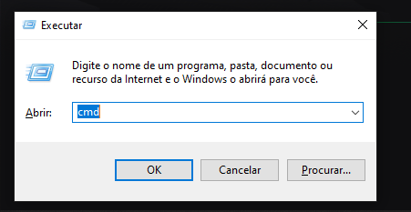
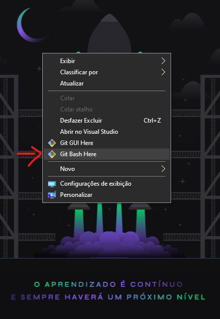
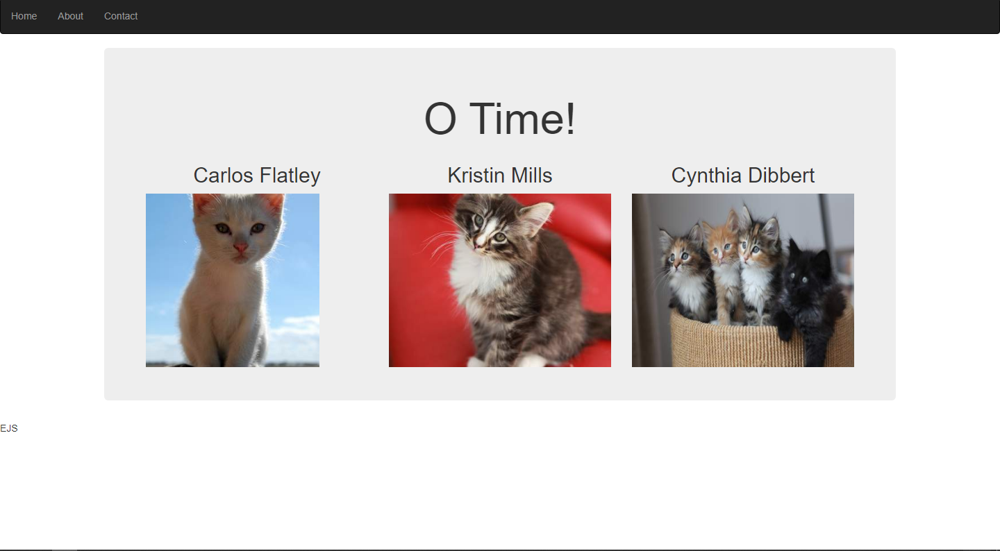
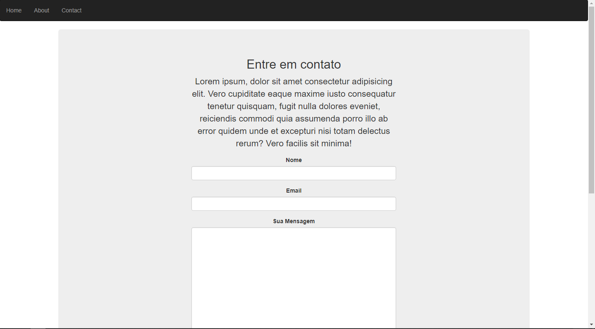
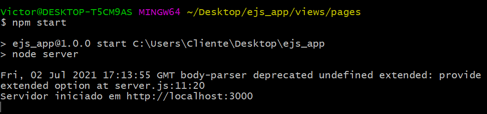

# Página Web com EJS (HTML inteligente)

<a href="https://developer.mozilla.org/pt-BR/docs/Web/HTML" target="blank"></a> <a href="https://developer.mozilla.org/pt-BR/docs/Web/CSS" target="blank"></a> <a href="https://developer.mozilla.org/pt-BR/docs/Web/JavaScript" target="blank"></a> <a href="https://www.codewars.com/users/Victor%20Hugo%20da%20Silva" target="blank"></a>

Essa página web foi produzida com auxílio do site [Utilizando a engine EJS para aplicações em NodeJS](https://hub.casadodesenvolvedor.com.br/topic/26-utilizando-a-engine-ejs-para-aplica%C3%A7%C3%B5es-em-nodejs/) por Karina Harumi. No artigo é mostrado como produzir uma página utilizando EJS, além de como funciona alguns pacotes do npm usados durante o projeto. Essa versão inicial está como a do site, porém vou ir melhorando para se tornar um projeto de minha autoria.

## Status do Projeto

#### 🚧 Em construção... 🚧

## Pré-requisitos

Para executar essa projeto será necessário você seguir alguns passos para não ocorrer nenhum erro. Primeiramente, você tem que ter instalado na sua máquina o [NodeJS](https://nodejs.org/en/) e o [Git](https://git-scm.com/).

Sem seguida abra seu terminal e entre na sua área de trabalho para melhor acesso. Para isso use as teclas win + r, e escreva cmd, como mostra a imagem abaixo:



Outra alternativa é você abrir o bash do GIT, pois agora com o git instalado em sua máquina opções como as mostradas abaixo estarão disponiveis para uso. Basta clicar em git bash, que um terminal será aberto.



Se você usar a 2° opção, você já estará na área de trabalho quando iniciar o bash. Agora se você usar o terminal do windows, será necessário digitar:

```bash
    cd desktop
```

Agora faça um git clone usando o comando:

```bash
    git clone https://github.com/VictorSilva15/EJS_APP.git
```

A pasta do projeto será instalada na sua maquina. Agora para executar, primeiramente entre no projeto com:

```bash
    cd ejs_app
```

Em seguida use:

```bash
    npm i
```

Esse comando fará a instalação da node_modules e das dependecias necessárias para a aplicação ser executada.

Se quiser modificar o código será necessário um editor de códigos de sua preferência. Recomendo usar o [Visual Studio Code](https://code.visualstudio.com/download)</a>.

<h2>Demonstração</h2>

- Página sobre:



- Tema Dark:



## Como usar

Para rodar a aplicação, você deve estar na pasta do projeto e dentro dela rode o seguinte comando:

```bash
    npm start
```

Isso fará com que a aplicação seja iniciada no localhost:3000 como mostra a imagem abaixo:




### 🛠 Tecnologias

As seguintes ferramentas foram usadas na construção do projeto:

- [EJS](https://ejs.co/)

- [Boostrap v3.3.7](https://maxcdn.bootstrapcdn.com/bootstrap/3.3.7/css/bootstrap.min.css")

- [JavaScript](https://developer.mozilla.org/pt-BR/docs/Web/JavaScript)

- [Express](https://expressjs.com/pt-br/)

---

- npm packgers

```bash
    npm i ejs
```

```bash
    npm i express
```

```bash
    npm i express-ejs-layouts
```

```bash
    npm i faker
```

```bash
    npm i nodemon
```

```bash
    npm i body-parser
```

---

## 💪 Como contribuir para o projeto

1. Faça um **fork** do projeto.

2. Crie uma nova branch com as suas alterações: `git checkout -b my-feature`

3. Salve as alterações e crie uma mensagem de commit contando o que você fez: `git commit -m "feature: My new feature"`

4. Envie as suas alterações: `git push origin my-feature`

> Caso tenha alguma dúvida confira este [guia de como contribuir no GitHub](./CONTRIBUTING.md)

---

### Autor


<sub><b>Victor Hugo</b></sub>🚀

Feito com dedicação por Victor Hugo da Silva 👋🏽 Entre em contato!

---

[](https://www.linkedin.com/in/victor-silva-9485021b2/)

[](mailto:victor470hugo@gmail.com)
